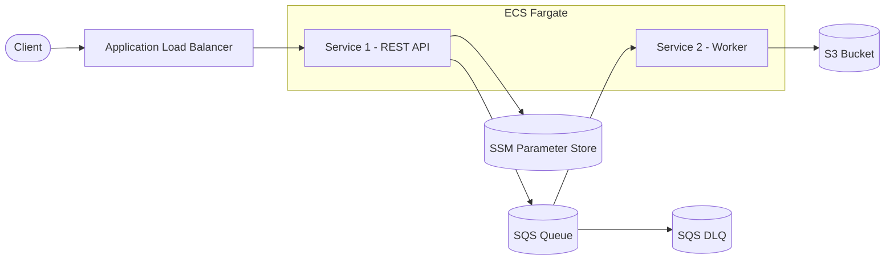
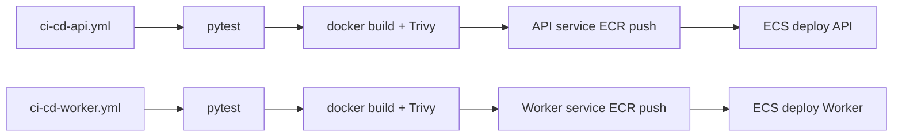

# ECS Email Pipeline

*Event driven pipeline on AWS* — accept messages over HTTP, queue them reliably, process them asynchronously, and persist results to object storage.

This repository implements a **two-service microservice system** (REST API + background worker) as a complete DevOps deliverable: **Infrastructure as Code**, **automated CI/CD**, **security scanning**, and **operational visibility** out of the box.

| Layer | Stack |
|-------|--------|
| **Runtime** | Python / Flask on **ECS Fargate** |
| **Messaging & storage** | **SQS** (with DLQ) → **S3** |
| **ALB** | **SSM Parameter Store** token |
| **IaC** | **Terraform** (`terraform/`) |
| **CI/CD** | **GitHub Actions** — test → build → **Trivy** scan → ECR push → ECS deploy |
| **Observability** | **CloudWatch** dashboards, alarms, and structured logs |

**Region:** `us-east-2` · **Naming prefix:** `email-pipeline-*`

---

## Architecture

### Application



### CI/CD (GitHub Actions)



### Request flow

1. Client sends `POST /messages` to the **ALB** (HTTP).
2. **Service 1 (API)** validates the JSON body and compares `token` to the secret in **SSM Parameter Store** (`/email-pipeline/auth-token`).
3. On success, the API enqueues the `data` object to **SQS**.
4. **Service 2 (worker)** polls SQS every `POLL_INTERVAL_SECONDS` (default 10s), uploads each message to **S3** as `emails/<message-id>-<timestamp>.json`, then deletes the queue message.
5. Messages that fail processing repeatedly are sent to a **dead-letter queue (DLQ)**.

The worker is not behind the ALB; it only exposes `/healthz` and `/status` for ECS health checks.

---

### Setup quickstart

1. **Clone** this repo.
2. **Configure AWS CLI** with credentials for an AWS account.
3. **Infrastructure** — [Deployment](#deployment) (Terraform `init` / `plan` / `apply` once).
4. **CI/CD** — set GitHub Actions secrets, then `git push origin main` ([CI/CD](#cicd)).
5. **Verify** — [Testing the API](#testing-the-api).
6. **Monitoring** — [Logs and monitoring](#logs-and-monitoring).

---

## Table of contents

1. [Repository layout](#repository-layout)
2. [Deployment](#deployment)
3. [CI/CD](#cicd)
4. [Testing the API](#testing-the-api)
5. [API reference](#api-reference)
6. [Logs and monitoring](#logs-and-monitoring)

---

## Repository layout

```text

├── service1/                      # REST API (Flask) — microservice 1
│   ├── app.py
│   ├── Dockerfile
│   ├── requirements.txt
│   └── tests/
├── service2/                      # SQS → S3 worker (Flask) — microservice 2
│   ├── app.py
│   ├── Dockerfile
│   ├── requirements.txt
│   └── tests/
├── terraform/                     # AWS infrastructure (Terraform)
│   ├── providers.tf               # AWS provider + S3 remote state backend
│   ├── variables.tf               # Inputs (e.g. alert_emails, auth_token, scaling)
│   ├── terraform.tfvars.example  
│   ├── outputs.tf
│   ├── vpc.tf
│   ├── alb.tf
│   ├── ecs.tf
│   ├── ecs_autoscaling.tf
│   ├── ecr.tf
│   ├── sqs.tf
│   ├── s3.tf
│   ├── ssm.tf
│   ├── iam.tf
│   ├── monitoring.tf              # CloudWatch dashboard, alarms, SNS
│   ├── backend.tf                 # State bucket + DynamoDB lock table
│   └── CodePipeline-CICD/         # Optional AWS CodePipeline + CodeBuild alternative
├── .github/workflows/
│   ├── ci-cd-api.yml
│   ├── ci-cd-worker.yml
│   └── cicd-template.yml          # Reusable: test → build → Trivy → push → ECS deploy
├── scripts/
│   └── trivy-scan.sh              # CI vulnerability gate
└── README.md
```

---

## Deployment

### 1. Configure variables

```bash
cp terraform/terraform.tfvars.example terraform/terraform.tfvars
```

Edit `terraform/terraform.tfvars`:

| Variable | Description |
|----------|-------------|
| `aws_region` | Default `us-east-2` |
| `auth_token` | Exam token; stored in SSM Parameter Store as `SecureString` (sensitive, no default) |
| `github_actions_repository` | `owner/repo` allowed to assume the GitHub Actions OIDC role. `""` disables OIDC role creation |
| `alert_emails` | List of emails for CloudWatch alarm SNS (each must confirm subscription after apply) |
| `backend_image_tag` / `worker_image_tag` | Bootstrap tag `latest`; CI/CD deploys **git commit SHA** afterwards |

`terraform.tfvars` is gitignored so secrets stay local.

### 2. Create infrastructure (Terraform)

Use AWS credentials for the **exam account** .

```bash
cd terraform
terraform init
terraform plan
terraform apply
```

**Remote Terraform state:** `providers.tf` uses an S3 backend (`terraform-state-email-pipeline`) with DynamoDB locking. In a fresh AWS account, bootstrap those resources first:

```bash
# Temporarily comment the backend "s3" block in providers.tf
terraform init
terraform apply \
  -target=aws_s3_bucket.tf_state \
  -target=aws_dynamodb_table.terraform_lock

# Uncomment the backend "s3" block, then migrate local state
terraform init -migrate-state
terraform apply
```

### 3. Deploy application images

push to `main` and let GitHub Actions build, scan, push to ECR, and deploy to ECS.

## CI/CD

**CI/CD tool:** **GitHub Actions**.  
An optional AWS-native CI/CD implementation is documented in `terraform/CodePipeline-CICD/` using CodePipeline and CodeBuild.

| Workflow | File | Deploys to |
|----------|------|------------|
| CI/CD — API (service1) | `.github/workflows/ci-cd-api.yml` | `email-pipeline-api-service` |
| CI/CD — Worker (service2) | `.github/workflows/ci-cd-worker.yml` | `email-pipeline-worker-service` |
| Reusable template | `.github/workflows/cicd-template.yml` | Called by both workflows |

### GitHub Actions setup (OIDC, no static AWS keys)

The workflows authenticate to AWS through **GitHub OIDC** — every run assumes
an IAM role for a short-lived STS session instead of using long-lived access
keys. The trust policy is scoped to this repository in Terraform.

1. Set `github_actions_repository = "OWNER/REPO"` in `terraform/terraform.tfvars`
   (e.g. `"shira/devops-exam"`). Then `terraform apply`.
2. Copy the role ARN from the Terraform output:
   ```bash
   terraform output -raw github_actions_role_arn
   ```
3. Add it to the GitHub repo:
   **Settings → Secrets and variables → Actions → Repository secrets**

   | Secret | Value |
   |--------|--------|
   | `AWS_DEPLOY_ROLE_ARN` | The ARN from step 2 |

   No `AWS_ACCESS_KEY_ID` / `AWS_SECRET_ACCESS_KEY` is required. The role has
   least-privilege scoped to: ECR push for the two service repos, ECS
   describe/register/update, and `iam:PassRole` for the three task roles
   (conditioned on `ecs-tasks.amazonaws.com`).


### Pipeline stages

1. **Test** — `pytest` in `service1/tests/` or `service2/tests/`
2. **CI** — `docker build` → **Trivy** (HIGH/CRITICAL fail the job) → **ECR push**
3. **CD** — Update ECS task definition with new image → deploy → wait for service stability

**Image tag:** Git commit SHA (`github.sha`), e.g.  
`371670420772.dkr.ecr.us-east-2.amazonaws.com/email-pipeline-backend-api-ecr:<sha>`

### Path triggers

Workflows run on push to `main` when relevant paths change:

| Workflow | Paths |
|----------|--------|
| API | `service1/**`, `scripts/trivy-scan.sh`, `ci-cd-api.yml`, `cicd-template.yml` |
| Worker | `service2/**`, `scripts/trivy-scan.sh`, `ci-cd-worker.yml`, `cicd-template.yml` |

### ECS runtime logs

| Component | CloudWatch log group |
|-----------|----------------------|
| API | `/ecs/email-pipeline-api` |
| Worker | `/ecs/email-pipeline-worker` |

Or: `terraform output -json cloudwatch_log_groups`

---

## Testing the API

Run from `terraform/` so `terraform output` works.

### 1. Health check

```powershell
$API_URL = terraform output -raw api_endpoint
Invoke-RestMethod -Uri "$API_URL/healthz"
```

Expected: `status : ok`

### 2. Submit a message

```powershell
$REGION = "us-east-2"
$API_URL = terraform output -raw api_endpoint
$TOKEN = aws ssm get-parameter --name "/email-pipeline/auth-token" --with-decryption --region $REGION --query "Parameter.Value" --output text

$body = @{
  data = @{
    email_subject    = "Happy new year!"
    email_sender     = "John doe"
    email_timestream = "1693561101"
    email_content    = "Just want to say... Happy new year!!!"
  }
  token = $TOKEN
} | ConvertTo-Json -Depth 3

Invoke-RestMethod -Method POST -Uri "$API_URL/messages" -ContentType "application/json" -Body $body
```

Expected: **202** and a `message_id`.

### 3. Confirm S3 upload

Wait ~15 seconds (worker poll interval), then:

```powershell
$BUCKET = terraform output -raw s3_bucket_name
aws s3 ls "s3://${BUCKET}/emails/" --recursive --region $REGION
```

---

## API reference

### `GET /healthz`

Liveness check for ALB and ECS.

### `GET /status` (worker only)

Worker status (not exposed on ALB).

### `POST /messages`

**Request body:**

```json
{
  "data": {
    "email_subject": "Happy new year!",
    "email_sender": "John doe",
    "email_timestream": "1693561101",
    "email_content": "Just want to say... Happy new year!!!"
  },
  "token": "$DJISA<$#45ex3RtYr"
}
```

| Rule | Detail |
|------|--------|
| `data` | All four fields required, non-empty |
| `email_timestream` | Valid Unix timestamp (seconds) |
| `token` | Must match SSM `/email-pipeline/auth-token` |

| HTTP status | Meaning |
|-------------|---------|
| `202` | Accepted; `message_id` in body |
| `400` | Invalid JSON or validation error |
| `401` | Invalid token |

---

## Logs and monitoring

**Bonus:** CloudWatch metrics, logs, dashboard, and alarms for microservices. CI/CD health is visible in **GitHub Actions**.

### CloudWatch dashboard

| Item | Value |
|------|--------|
| Name | `ecs-email-pipeline-dashboards` |
| Widgets | ALB requests & 5XX, SQS depth & DLQ, API/worker ECS CPU & memory |
| Terraform | `terraform/monitoring.tf` |
| Container Insights | Enabled on ECS cluster |


### Alarms & SNS email

Set `alert_emails` in `terraform/terraform.tfvars` (see `terraform.tfvars.example`). After `terraform apply`, **each address must confirm** its SNS subscription (AWS sends one confirmation email per recipient).

| Alarm | Meaning |
|-------|---------|
| `email-pipeline-sqs-dlq-messages` | Message(s) in DLQ |
| `email-pipeline-sqs-backlog-high` | Main queue backlog > 50 |
| `email-pipeline-alb-target-5xx` | Too many target 5XX |
| `email-pipeline-api-cpu-high` / `api-memory-high` | API CPU or memory > 85% |
| `email-pipeline-worker-cpu-high` / `worker-memory-high` | Worker CPU or memory > 85% |
| `email-pipeline-api-log-errors` | ERROR lines in API logs |
| `email-pipeline-worker-log-errors` | ERROR lines in worker logs |


Leave `alert_emails = []` to skip SNS 

### View logs (CLI)

```powershell
aws logs tail /ecs/email-pipeline-api --since 30m --region us-east-2 --format short
aws logs tail /ecs/email-pipeline-worker --since 30m --region us-east-2 --format short
```

### Security scanning

- **Trivy** in CI — blocks push/deploy on HIGH/CRITICAL
- **ECR scan on push** — enabled in Terraform

### Generate metrics

Send a few `POST /messages` requests, wait ~10s, then check S3, SQS metrics, and dashboard/alarms via CLI.

---

**Destroy when finished:**

```bash
cd terraform
terraform destroy
```